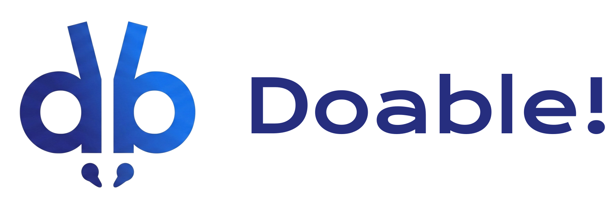
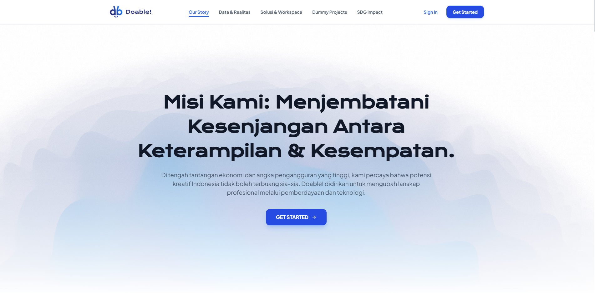
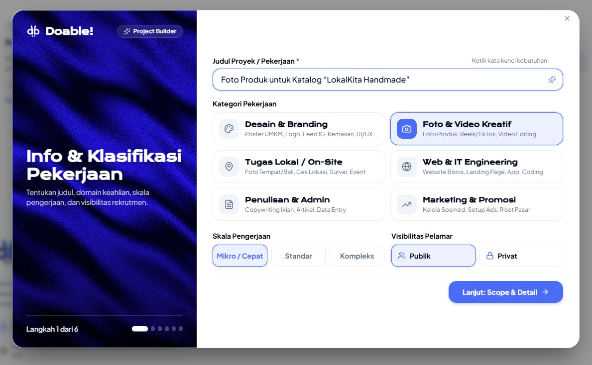
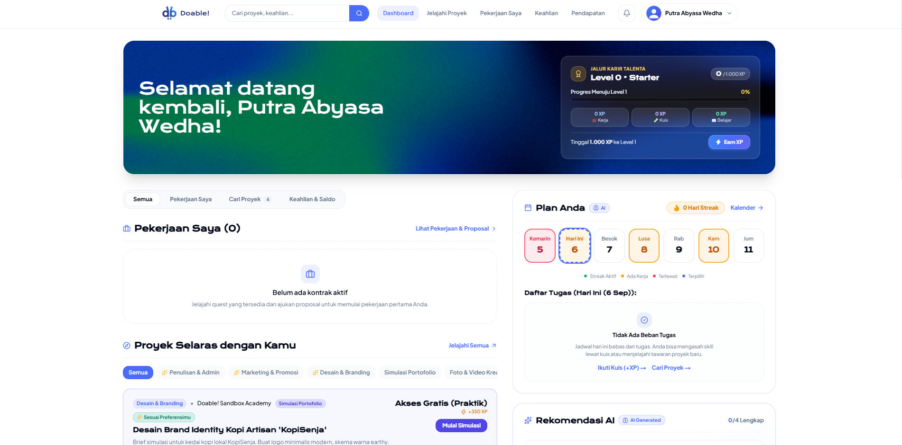
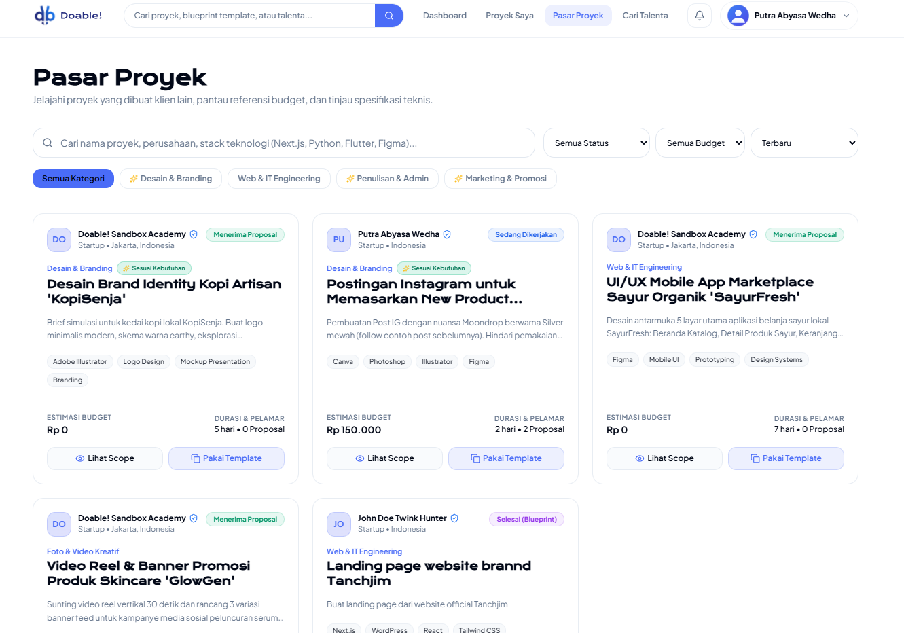
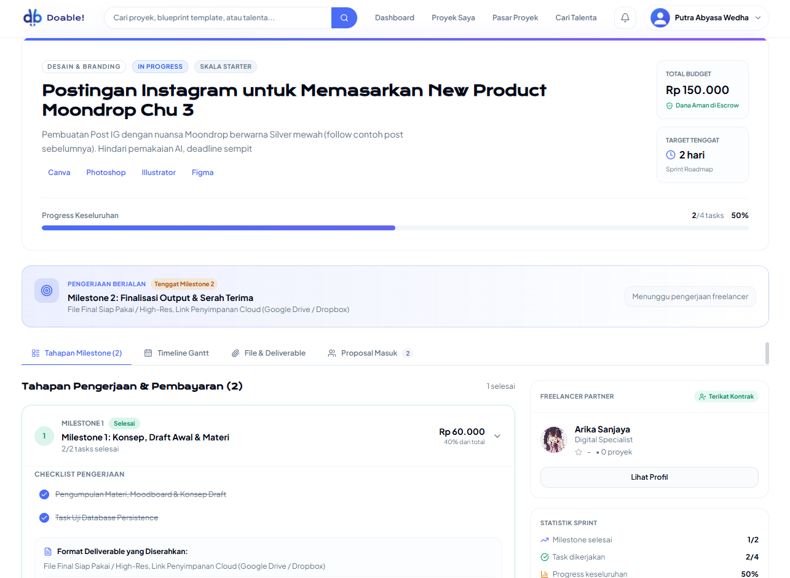

<div align="center">
  
  
  ### All-in-one freelance ecosystem yang menyatukan marketplace, project management, dan learning platform dalam satu tempat.
  
  [](https://triple-t-lime.vercel.app/)
  [](https://github.com/Abysswdh/TripleT)
  [](https://nextjs.org/)
  [](https://supabase.com/)
  [](LICENSE)
  
  **Submission for ITECHNO CUP 2026, Web Development**
  
  **By TripleT**

</div>

---

## 📋 Daftar Isi

- [Tentang Proyek](#-tentang-proyek)
- [Fitur Unggulan](#-fitur-unggulan)
- [Demo & Video](#-demo--video)
- [Teknologi](#️-teknologi)
- [Arsitektur Sistem](#️-arsitektur-sistem)
- [Instalasi & Setup](#️-instalasi--setup)
- [Tim Developer](#-tim-developer)
- [Lisensi](#-lisensi)

---

## 👥 Tim Developer

| Nama | Peran | GitHub |
|------|-------|--------|
| **Putra Abyasa Wedha** | Project Lead & Full Stack Developer | [GitHub](https://github.com/Abysswdh) |
| **I Wayan Gede Arika Sanjaya** | Fullstack Developer | [GitHub](https://github.com/arwxsh) |
| **I Putu Bryan Ello Winata** | Frontend Developer | [GitHub](https://github.com/Ello-bit) |

---

## 🎯 Tentang Proyek

### Latar Belakang

Di era digital yang serba terhubung ini, jutaan anak muda Indonesia justru masih kesulitan mendapatkan pekerjaan yang layak. Menurut Badan Pusat Statistik (BPS), tingkat pengangguran terbuka Indonesia pada Februari 2026 mencapai **4,68%**, setara dengan **7,24 juta orang** yang menganggur. Angka tersebut lebih tinggi dibanding negara ASEAN lain menurut proyeksi IMF 2026 seperti Vietnam (2,1%), Thailand (1%), Singapura (2%), dan Malaysia (3%).

Permasalahan ini terutama menimpa generasi muda. Kelompok usia 15-24 tahun memiliki tingkat pengangguran tertinggi di **16,36%**, yang berarti kira-kira **1 dari 6 anak muda** dalam angkatan kerja belum memperoleh pekerjaan. Di sisi lain, 57,80% penduduk bekerja Indonesia masih berada di sektor informal pada 2025, sehingga banyak orang memang bekerja tetapi belum tentu memiliki pekerjaan yang stabil, terlindungi, dan memberi jalur karier yang jelas.

Kondisi tersebut bukan hanya terjadi karena keterbatasan lowongan, tetapi juga karena ada jarak antara kesiapan kandidat dan kebutuhan perusahaan. Menurut riset Populix dan KitaLulus yang dikutip ANTARA, **63% pencari kerja terkendala persyaratan pengalaman kerja**, sementara **46% perusahaan kesulitan menemukan kandidat yang sesuai**. Artinya, banyak anak muda belum memiliki pengalaman praktis, portofolio, atau bukti keterampilan yang dapat ditunjukkan ketika melamar kerja. Akibatnya, mereka lebih berisiko bertahan pada pekerjaan low-level atau informal daripada masuk ke peran yang lebih sesuai dengan kemampuan mereka.

### Solusi yang Ditawarkan

**Doable!** adalah platform web-app yang menggabungkan **marketplace freelance** dengan **project management workspace** yang komprehensif, sebuah fusi antara **Fiverr** dan **Notion**. Di sini, klien dan freelancer tidak sekadar bertemu dan berpisah, tetapi bekerja bersama dalam satu ruang digital yang terintegrasi penuh.

Klien bisa memposting proyek dengan mudah, cukup dengan mengisi judul, deskripsi singkat, kategori, dan deadline tanpa perlu pusing menyusun struktur proyek dari nol. Sementara itu, freelancer pemula hingga expert bisa menemukan proyek yang sesuai dengan keterampilan mereka, membangun portofolio dari setiap pekerjaan yang diselesaikan, dan mendapatkan pengalaman nyata yang selama ini menjadi syarat utama dunia kerja.

Yang membedakan Doable! dari platform freelance lainnya adalah integrasi menyeluruh. Setelah klien dan freelancer sepakat untuk bekerja sama, mereka langsung masuk ke workspace project management bawaan yang sudah dilengkapi dengan Gantt chart interaktif untuk visualisasi timeline, task management untuk membagi pekerjaan ke dalam sub-task yang terstruktur, milestone tracking untuk memantau progress, serta fitur chat real-time untuk komunikasi langsung tanpa harus berpindah ke WhatsApp atau aplikasi messaging lain. Semua ini tersedia dalam satu platform, sehingga seluruh alur kerja dari penemuan proyek hingga penyelesaian bisa dilakukan tanpa perlu membuka aplikasi tambahan.

### Tujuan Proyek

- 🎯 **Tujuan Utama**: Menjembatani kesenjangan antara pencari kerja muda yang belum berpengalaman dengan kebutuhan industri, melalui platform freelance yang dilengkapi tools profesional sehingga pengguna bisa bekerja, belajar, dan berkembang dalam satu ekosistem yang terpadu.
- 📊 **Target Pengguna**: Mahasiswa, fresh graduate, dan profesional muda (18-30 tahun) yang ingin memulai atau mengembangkan karir freelance, serta klien dan UMKM yang mencari talenta digital fleksibel untuk mengerjakan proyek-proyek mereka.
- 💡 **Value Proposition**: **All-in-one platform** yang menghilangkan kebutuhan untuk berpindah-pindah antar aplikasi. Pengguna tidak perlu lagi menggunakan WhatsApp untuk komunikasi, Notion untuk project management, atau Udemy untuk belajar secara terpisah. Doable! mengintegrasikan marketplace, project management lengkap dengan Gantt chart dan task tracking, real-time chat, serta gamified learning dalam satu aplikasi yang saling terhubung.

---

## ✨ Fitur Unggulan

### Fitur Utama

| Fitur | Deskripsi | Keunggulan |
|-------|-----------|------------|
| **🏪 Freelance Marketplace** | Marketplace dua arah di mana klien dapat memposting proyek lengkap dengan deskripsi, kategori, budget, dan deadline, sementara freelancer dapat menjelajahi, memfilter, dan mengajukan proposal pada proyek yang sesuai dengan keahlian mereka. Dilengkapi dengan sistem pencarian, filter kategori, dan rekomendasi proyek. | Terintegrasi langsung dengan project management. Setelah kedua pihak sepakat, mereka langsung masuk ke workspace kolaboratif tanpa perlu pindah platform atau setup tools tambahan. |
| **📊 Project Management + Gantt Chart** | Workspace kolaboratif yang menyediakan Gantt chart interaktif untuk memvisualisasikan timeline proyek secara keseluruhan, task management untuk memecah pekerjaan besar menjadi sub-task yang terstruktur, milestone tracking untuk menandai pencapaian penting, serta timeline management untuk memastikan setiap tahapan proyek berjalan sesuai jadwal. Klien dan freelancer bisa memantau progress secara real-time dalam satu dashboard yang sama. | Menggantikan kebutuhan tools project management terpisah seperti Notion, Trello, atau Asana. Semua pengelolaan proyek dilakukan di dalam platform yang sama dengan marketplace, sehingga alur kerja dari penemuan proyek hingga penyelesaian menjadi seamless dan efisien. |
| **📚 Gamified Learning & Quiz** | Sistem pembelajaran interaktif yang menyediakan learning resources berupa materi-materi skill yang relevan dengan dunia freelance, serta quiz untuk memvalidasi penguasaan skill. Freelancer pemula bisa menggunakan fitur ini untuk belajar dan meningkatkan kemampuan, sementara freelancer yang sudah berpengalaman bisa mengambil quiz untuk membuktikan kompetensi mereka dan mendapatkan badge sebagai bukti keahlian. | Sistem gamifikasi dengan badge dan progress tracking mendorong engagement pengguna. Freelancer bisa belajar sambil mengerjakan proyek nyata, membangun portofolio dan skill set secara bersamaan. |
| **💬 Real-time Chat** | Sistem komunikasi langsung yang memungkinkan klien dan freelancer berdiskusi mengenai detail proyek, memberikan feedback, dan berkoordinasi tanpa harus meninggalkan platform. Chat terintegrasi dengan konteks proyek sehingga percakapan selalu relevan. | Menghilangkan kebutuhan untuk berpindah ke WhatsApp, Telegram, atau platform messaging lain. Semua komunikasi proyek terdokumentasi di satu tempat yang mudah diakses oleh kedua belah pihak. |

### Fitur Tambahan

- **🎨 Onboarding Interaktif**: Video welcome screen yang memperkenalkan platform dengan cara yang engaging, dilanjutkan dengan guided setup yang menyesuaikan pengalaman berdasarkan role yang dipilih (klien atau freelancer). Proses onboarding dirancang agar pengguna baru dapat langsung memahami dan menggunakan platform tanpa kebingungan.
- **👤 Profil & Portofolio**: Halaman profil profesional yang menampilkan informasi lengkap pengguna, termasuk showcase portofolio pekerjaan yang telah diselesaikan, skill badges yang diperoleh dari quiz, dan riwayat proyek sebagai bukti pengalaman kerja.
- **🔔 Notifikasi Real-time**: Sistem notifikasi yang memberikan update secara langsung untuk berbagai event penting seperti pesan baru, update status proyek, milestone yang tercapai, dan proposal yang masuk.
- **⚙️ Pengaturan Akun**: Panel pengaturan yang komprehensif untuk mengelola informasi profil, preferensi tampilan, dan keamanan akun dengan interface yang intuitif dan mudah digunakan.
- **📱 Responsive Design**: Tampilan yang dioptimalkan untuk berbagai ukuran layar mulai dari desktop, tablet, hingga mobile. Dilengkapi dengan animasi micro-interaction yang smooth untuk pengalaman pengguna yang premium.
- **🌐 Role-based Dashboard**: Dashboard yang secara otomatis menyesuaikan tampilan dan fitur yang tersedia berdasarkan role pengguna. Klien mendapatkan akses ke fitur posting proyek dan manajemen talent, sementara freelancer mendapatkan akses ke fitur pencarian proyek dan pengelolaan portofolio.

---

## 📸 Demo & Video

### 🔗 Live Demo

**[👉 Kunjungi Doable!](https://triple-t-lime.vercel.app/)**

### Screenshot Aplikasi

<div align="center">
  
  <p><em>Landing Page - Halaman utama yang memperkenalkan Doable! dengan animasi interaktif dan overview fitur platform</em></p>
  
  
  <p><em>Onboarding - Proses guided setup dengan video welcome dan pemilihan role (klien/freelancer)</em></p>
  
  
  <p><em>Dashboard - Panel utama pengguna dengan overview proyek, statistik, dan akses cepat ke seluruh fitur</em></p>
  
  
  <p><em>Marketplace - Jelajahi dan temukan proyek atau talenta freelancer dengan filter kategori dan pencarian</em></p>
  
  
  <p><em>Project Management - Workspace kolaboratif dengan Gantt chart, task tracking, dan timeline management</em></p>
</div>

### 📹 Video Demo

**[📂 Tonton Video Demo di Google Drive](https://drive.google.com/drive/folders/1oowRB0q6nBLAREbKosVVWGHzm4nH1Q7j?usp=sharing)**

---

## 🛠️ Teknologi

### Tech Stack

#### Frontend
```
Framework       : Next.js 14 (App Router)
Language        : TypeScript
UI / Styling    : Tailwind CSS 3.4 + tailwindcss-animate
Component Lib   : Radix UI (Dialog, Dropdown, Avatar, Label, Separator)
Animation       : Framer Motion, GSAP, AOS (Animate On Scroll)
3D Graphics     : Three.js + React Three Fiber, OGL
Icons           : Lucide React
Utilities       : clsx, tailwind-merge, class-variance-authority
```

#### Backend & Data
```
BaaS            : Supabase (Auth, Database, Storage, Realtime)
Database        : PostgreSQL (via Supabase)
Auth            : Supabase Auth + SSR (@supabase/ssr)
API Routes      : Next.js API Routes (Route Handlers)
```

#### DevOps & Deployment
```
Hosting         : Vercel
Version Control : Git + GitHub
Package Manager : npm
Linting         : ESLint (eslint-config-next)
Build Tool      : Next.js built-in (SWC compiler)
```

### Alasan Pemilihan Teknologi

| Teknologi | Alasan Pemilihan |
|-----------|------------------|
| **Next.js 14** | App Router dengan React Server Components memungkinkan rendering hybrid (SSR/SSG/CSR) untuk performa optimal. File-based routing mempercepat development dan route group memudahkan organisasi halaman berdasarkan role pengguna. Selain itu, built-in API routes menghilangkan kebutuhan untuk membuat backend server terpisah. |
| **Supabase** | Open-source Firebase alternative yang menyediakan PostgreSQL database, Authentication, Realtime subscriptions, dan Storage dalam satu platform yang terintegrasi. Dengan menggunakan Supabase, kompleksitas backend berkurang secara signifikan karena tidak perlu membangun dan mengelola server backend secara manual. Realtime subscriptions juga memungkinkan fitur seperti chat dan notifikasi berjalan secara real-time. |
| **Tailwind CSS** | Utility-first CSS framework yang mempercepat proses styling tanpa perlu meninggalkan file HTML/JSX. Dikombinasikan dengan `tailwindcss-animate` untuk animasi CSS yang ringan dan `class-variance-authority` untuk membuat variant komponen yang konsisten dan mudah di-maintain. Pendekatan ini menghasilkan bundle CSS yang lebih kecil karena hanya menginclude utility class yang benar-benar digunakan. |
| **Framer Motion + GSAP** | Kombinasi dua animation library terbaik di ekosistem web. Framer Motion digunakan untuk animasi deklaratif yang terintegrasi erat dengan React component lifecycle, seperti page transitions dan mount/unmount animations. GSAP digunakan untuk animasi timeline yang lebih kompleks dan scroll-triggered effects, memberikan pengalaman visual yang premium dan engaging bagi pengguna. |
| **Radix UI** | Headless, accessible UI primitives yang memberikan kontrol penuh atas styling sambil menjamin aksesibilitas sesuai standar WAI-ARIA. Dengan menggunakan Radix UI, komponen-komponen kompleks seperti Dialog, Dropdown Menu, dan Avatar sudah ter-handle dari sisi accessibility dan keyboard navigation, sehingga developer bisa fokus pada styling dan business logic. |
| **TypeScript** | Static typing yang mencegah bug di compile-time sebelum kode masuk ke production. TypeScript meningkatkan developer experience secara signifikan melalui IntelliSense dan auto-completion di IDE, dan membuat proses refactoring jauh lebih aman di proyek berskala besar. Type definitions juga berfungsi sebagai dokumentasi hidup yang selalu up-to-date. |

### Dependencies Utama

```json
{
  "dependencies": {
    "next": "14.2.35",
    "@supabase/supabase-js": "^2.112.3",
    "@supabase/ssr": "^0.12.4",
    "framer-motion": "^13.1.1",
    "gsap": "^3.15.0",
    "three": "^0.185.1",
    "@react-three/fiber": "^8.18.0",
    "@radix-ui/react-dialog": "^1.1.23",
    "@radix-ui/react-dropdown-menu": "^2.1.24",
    "tailwindcss": "^3.4.1",
    "tailwindcss-animate": "^1.0.7",
    "lucide-react": "^1.31.0",
    "class-variance-authority": "^0.7.1",
    "aos": "^2.3.4",
    "ogl": "^1.0.11"
  }
}
```

---

## 🏗️ Arsitektur Sistem

### System Architecture

```
┌─────────────────────────────────────────────────────────┐
│                        CLIENT                           │
│              (Browser, Next.js Frontend)                │
│                                                         │
│   ┌──────────┐  ┌───────────┐  ┌─────────────────────┐ │
│   │ Landing  │  │   Auth    │  │     Dashboard       │ │
│   │  Page    │  │(Login/Reg)│  │ (Client/Freelancer) │ │
│   └──────────┘  └───────────┘  └─────────────────────┘ │
│                                  │                      │
│         ┌────────────────────────┼──────────────┐       │
│         │            │           │              │       │
│    ┌────┴───┐  ┌─────┴────┐ ┌───┴────┐  ┌─────┴────┐  │
│    │Market- │  │  Project │ │  Chat  │  │ Learning │  │
│    │ place  │  │  Mgmt +  │ │  Room  │  │ & Quiz   │  │
│    │        │  │  Gantt   │ │        │  │          │  │
│    └────┬───┘  └────┬─────┘ └───┬────┘  └────┬─────┘  │
│         └───────────┼───────────┼────────────┘         │
└─────────────────────┼───────────┼──────────────────────┘
                      │           │
            ┌─────────▼───────────▼──────────┐
            │     Next.js API Routes         │
            │      (Route Handlers)          │
            └─────────────┬──────────────────┘
                          │
            ┌─────────────▼──────────────────┐
            │         SUPABASE               │
            │                                │
            │  ┌──────┐ ┌─────┐ ┌─────────┐  │
            │  │ Auth │ │ DB  │ │Realtime │  │
            │  │      │ │(PG) │ │         │  │
            │  └──────┘ └─────┘ └─────────┘  │
            │  ┌─────────┐                   │
            │  │ Storage │                   │
            │  └─────────┘                   │
            └────────────────────────────────┘
```

### Folder Structure

```
TripleT/
├── public/                     # Static assets (images, videos, fonts)
├── src/
│   ├── app/
│   │   ├── (auth)/             # Auth route group
│   │   │   ├── login/          #   Login page
│   │   │   ├── register/       #   Registration page
│   │   │   └── onboarding/     #   Guided onboarding flow
│   │   ├── (dashboard)/        # Dashboard route group
│   │   │   └── dashboard/      #   Role-based dashboard views
│   │   │       ├── chat/       #     Real-time messaging
│   │   │       ├── projects/   #     Project management + Gantt
│   │   │       ├── explore/    #     Marketplace exploration
│   │   │       ├── talent/     #     Talent discovery
│   │   │       ├── learning/   #     Learning resources & quiz
│   │   │       └── settings/   #     User settings
│   │   ├── api/                # Next.js API routes
│   │   ├── auth/               # Auth callback handlers
│   │   ├── fonts/              # Custom fonts
│   │   ├── globals.css         # Global styles & Tailwind directives
│   │   ├── layout.tsx          # Root layout (metadata, providers)
│   │   └── page.tsx            # Landing page
│   ├── components/             # Reusable UI components
│   │   ├── dashboard/          #   Dashboard-specific components
│   │   ├── landing/            #   Landing page sections
│   │   ├── settings/           #   Settings panel components
│   │   └── ui/                 #   Shared UI primitives (Button, Dialog, etc.)
│   ├── context/                # React context providers
│   ├── hooks/                  # Custom React hooks
│   ├── lib/                    # Utilities & Supabase client
│   ├── locales/                # i18n translation files
│   ├── types/                  # TypeScript type definitions
│   └── middleware.ts           # Next.js middleware (auth guards)
├── tailwind.config.ts          # Tailwind configuration
├── next.config.mjs             # Next.js configuration
├── tsconfig.json               # TypeScript configuration
└── package.json                # Dependencies & scripts
```

---

## ⚙️ Cara Mengakses

### Live Demo (Rekomendasi)

Cara tercepat untuk mencoba Doable! adalah melalui live demo yang sudah di-deploy dan siap digunakan:

🔗 **[https://triple-t-lime.vercel.app/](https://triple-t-lime.vercel.app/)**

Cukup buka link di atas, buat akun baru, dan mulai eksplorasi seluruh fitur yang tersedia.

### Local Development

Untuk menjalankan proyek secara lokal (misalnya untuk keperluan penilaian juri), ikuti langkah berikut:

#### 1️⃣ Clone & Install

```bash
git clone https://github.com/Abysswdh/TripleT.git
cd TripleT
npm install
```

#### 2️⃣ Setup Environment Variables

Buat file `.env.local` di root directory dengan isi berikut:

```env
NEXT_PUBLIC_SUPABASE_URL=https://vglfiuflqokjqosquici.supabase.co
NEXT_PUBLIC_SUPABASE_ANON_KEY=sb_publishable_qrdjReSVyv1IZ7CN1dKMEQ_hBbDB25A
```

#### 3️⃣ Jalankan

```bash
npm run dev
```

Aplikasi akan berjalan di `http://localhost:3000`

---

## 📄 Lisensi

Proyek ini dilisensikan di bawah [MIT License](LICENSE). Lihat file LICENSE untuk detail lebih lanjut.

---

<div align="center">

  **Made with ❤️ by TripleT for ITECHNO CUP 2026**

  [🚀 Live Demo](https://triple-t-lime.vercel.app/) · [📂 Video Demo](https://drive.google.com/drive/folders/1oowRB0q6nBLAREbKosVVWGHzm4nH1Q7j?usp=sharing) · [📦 Repository](https://github.com/Abysswdh/TripleT)

</div>
